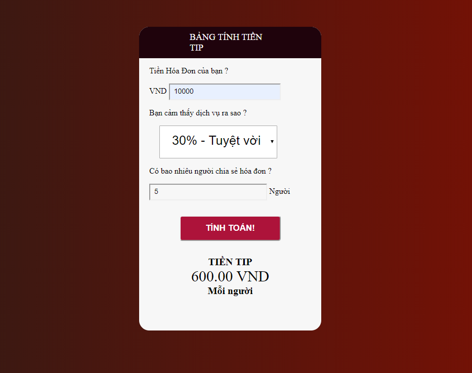

Giới thiệu về Bảng Tính Tiền TIP
     
      Đây là công cụ đê tính tiền TIP 
      Tiền tip được hiểu là tiền boa, tiền cho thêm của khách hàng với nhân viên nhằm thể hiện sự hài lòng cũng như cảm kích của họ về chất lượng dịch vụ ở đó. Trong ngành Nhà hàng – Khách sạn, mọi bộ phận đều có thể nhận được tiền tip từ khách hàng: Nhân viên Phục vụ, Lễ tân, nhân viên Đứng cửa, nhân viên Hành lý,… Dù ít hay nhiều thì tiền tip cũng có ý nghĩa tạo động lực, niềm vui cho nhân viên trong nhà hàng, khách sạn vì nhận được đánh giá tốt từ khách hàng  